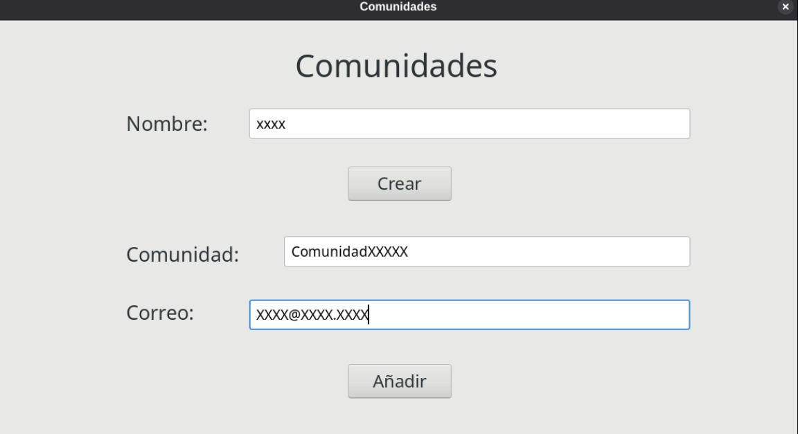
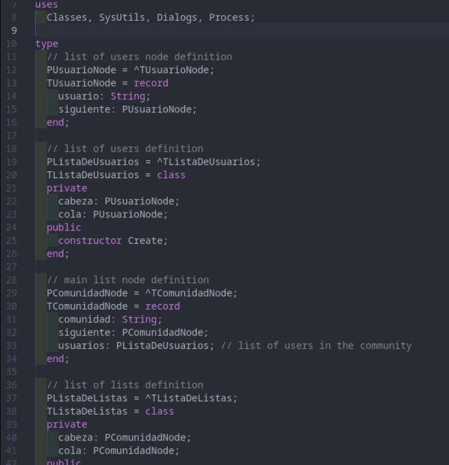
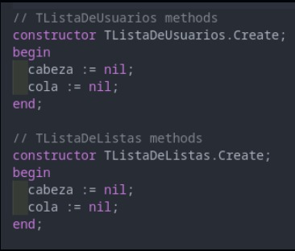
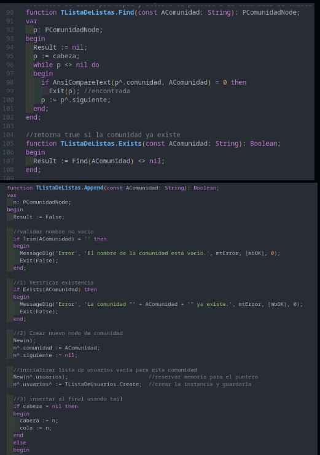
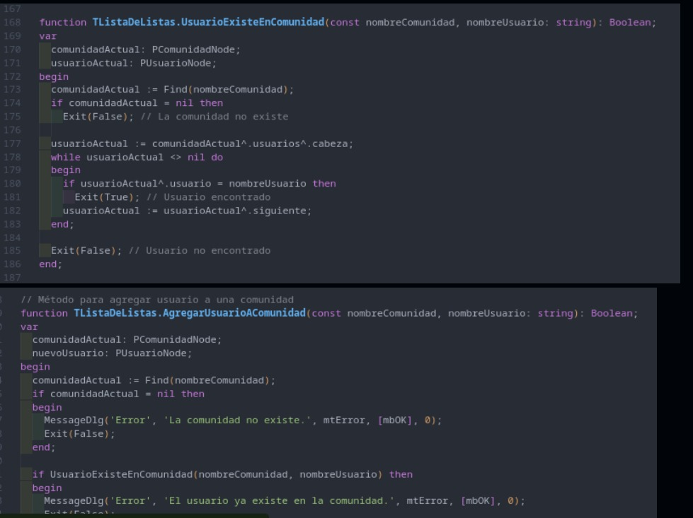
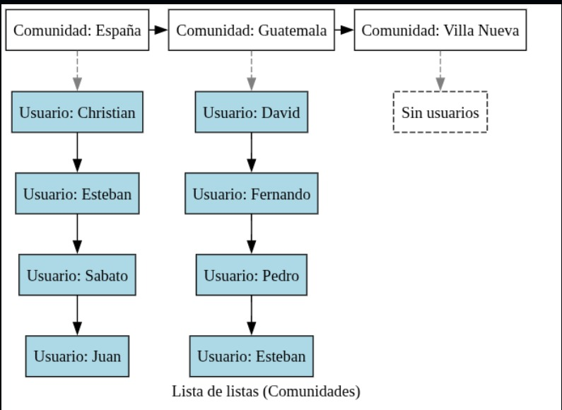

# Manual de Integración por Grupos — EDDMail Fase 1
**Grupo 11**  
**Curso:** Estructuras de Datos (EDD)   
**Funcionalidad:** Comunidades (Lista de listas: Comunidades → Usuarios)

---

## 1) Membrete integrantes — porcentaje de trabajo (0–100%)

| Nombre completo                           | Carné     | Rol principal                                                             | % |
|---|---|---|---:|
| **Christian David Chinchilla Santos**     | 202308227 | Estructura de **comunidades** (Find/Exists/Append, validaciones, punteros) | 30 |
| **Sebastián Antonio Romero Tzitizmit**    | 202201690 | **Usuarios en comunidad** (verificación e inserción en lista interna)       | 30 |
| **Eduardo Sebastián Gutiérrez Felipe**    | 202300694 | **Graphviz** (reporte visual de comunidades) + **GUI** de comunidades       | 40 |

**Total:** 100%

---

## 2) Estructura general (Lista de listas)

La integración se modela como una **lista simple de comunidades**, donde cada nodo de comunidad contiene un puntero a una **lista simple de usuarios**.


---
### Archivos/rutas del proyecto (Grupo 11)
- **Estructura (lista de listas):** `Fase1/src/lista-de-listas/ListaDeListas.pas`
- **Programa de prueba (consola):** `Fase1/src/lista-de-listas/test.pas`
- **GUI (formulario):** `Fase1/src/GUI/comunidadesmenu.pas` y `comunidadesmenu.lfm`
- **Proyecto Lazarus:** `Fase1/src/Integracion.lpi` (y archivos asociados)


## 3) ¿Cómo se integró en cada proyecto individual?

> **Requisito de entregable:** incluir capturas de cómo cada miembro integró su parte y capturas de estructuras/reportes. :contentReference[oaicite:5]{index=5}

### 3.1 Aporte de Christian (202308227) — **Comunidades**
**Archivo:** `Fase1/src/lista-de-listas/ListaDeListas.pas`  
**Puntos clave implementados:**
- **Buscar comunidad** (recorrido):  

  ```pascal
  function TListaDeListas.Find(const AComunidad: String): PComunidadNode;
  var p: PComunidadNode;
  begin
    Result := nil; p := cabeza;
    while p <> nil do begin
      if AnsiCompareText(p^.comunidad, AComunidad) = 0 then Exit(p);
      p := p^.siguiente;
    end;
  end;
  ```
- **Buscar comunidad**
    ```pascal
    function TListaDeListas.Exists(const AComunidad: String): Boolean;
    begin
    Result := Find(AComunidad) <> nil;
    end;
    ```
- **Insertar al final con validaciones y lista interna de usuarios**
```pascal
    function TListaDeListas.Append(const AComunidad: String): Boolean;
    var n: PComunidadNode;
    begin
        if Trim(AComunidad) = '' then Exit(False);
        if Exists(AComunidad) then Exit(False);
        New(n); n^.comunidad := AComunidad; n^.siguiente := nil;
        New(n^.usuarios); n^.usuarios^ := TListaDeUsuarios.Create;
        if cabeza = nil then begin cabeza := n; cola := n; end
        else begin cola^.siguiente := n; cola := n; end;
        Result := True;
    end;

```


### 3.2 Aporte de Sebastián (202201690) — Usuarios en comunidad
**Archivo:** `Fase1/src/lista-de-listas/ListaDeListas.pas`  

- **Verificar si un usuario ya pertenece a la comunidad:**
    ```pascal
    function TListaDeListas.UsuarioExisteEnComunidad(
    const nombreComunidad, nombreUsuario: string): Boolean;
    var comunidadActual: PComunidadNode; usuarioActual: PUsuarioNode;
    begin
    comunidadActual := Find(nombreComunidad); if comunidadActual = nil then Exit(False);
    usuarioActual := comunidadActual^.usuarios^.cabeza;
    while usuarioActual <> nil do begin
        if usuarioActual^.usuario = nombreUsuario then Exit(True);
        usuarioActual := usuarioActual^.siguiente;
    end;
    Result := False;
    end;
    ```


- **Agregar usuario al final de la lista interna**
    ```pascal
        function TListaDeListas.AgregarUsuarioAComunidad(
        const nombreComunidad, nombreUsuario: string): Boolean;
        var comunidadActual: PComunidadNode; nuevoUsuario: PUsuarioNode;
        begin
        comunidadActual := Find(nombreComunidad); if comunidadActual = nil then Exit(False);
        if UsuarioExisteEnComunidad(nombreComunidad, nombreUsuario) then Exit(False);
        New(nuevoUsuario); nuevoUsuario^.usuario := nombreUsuario; nuevoUsuario^.siguiente := nil;
        if comunidadActual^.usuarios^.cabeza = nil then begin
            comunidadActual^.usuarios^.cabeza := nuevoUsuario;
            comunidadActual^.usuarios^.cola := nuevoUsuario;
        end else begin
            comunidadActual^.usuarios^.cola^.siguiente := nuevoUsuario;
            comunidadActual^.usuarios^.cola := nuevoUsuario;
        end;
        Result := True;
        end;

    ```

### 3.3 Aporte de Eduardo Sebastián Gutiérrez Felipe (202300694) — Graphviz + GUI

**Archivos principales:**
- `Fase1/src/lista-de-listas/ListaDeListas.pas` → método `graph()`
- `Fase1/src/GUI/comunidadesmenu.pas` y `comunidadesmenu.lfm` → formulario de interfaz gráfica

**Responsabilidades:**
- Implementó el método **`graph()`**, encargado de generar un archivo `.dot` con la representación de la lista de listas y convertirlo en un `.svg` usando **Graphviz**.  
  - Muestra las **comunidades** como nodos principales.  
  - Cada comunidad enlaza con su lista de **usuarios** en nodos secundarios.  
  - Si una comunidad no tiene usuarios, se crea un nodo gris indicando *“Sin usuarios”*.  
- Integró la **interfaz gráfica (GUI)** en Lazarus/GTK para la gestión de comunidades:  
  - **Crear comunidad:** botón `Crear` llama a `listaComunidades^.Append(nombre)`.  
  - **Agregar usuario:** botón `Añadir` llama a `listaComunidades^.AgregarUsuarioAComunidad(comunidad, correo)`.  
  - **Generar reporte:** botón `Reporte de comunidades` invoca el método `graph()` y abre el archivo `.svg`.

**Fragmento de código relevante (Graphviz):**
```pascal
procedure TListaDeListas.graph();
begin
  filePath := './lista_listas_comunidades.dot';
  svgFilePath := './lista_listas_comunidades.svg';  
end;
```


## 4) Flujo de uso (GUI de Comunidades)

> Requisitos previos: proyecto compilado con Lazarus/GTK y Graphviz instalado (`dot` disponible en PATH).

**Pantalla:** `Fase1/src/GUI/comunidadesmenu.pas` / `comunidadesmenu.lfm`

1. **Crear comunidad (root)**
   - Campo **Nombre** → escribir el nombre de la comunidad.
   - Clic en **Crear**.
   - Internamente ejecuta: `listaComunidades^.Append(nombre)`.
   - Validaciones:
     - No permite nombre vacío.
     - Muestra error si la comunidad ya existe.

2. **Agregar usuario a comunidad**
   - Campo **Comunidad** → nombre exacto de una comunidad existente.
   - Campo **Correo** → identificador del usuario (correo/usuario).
   - Clic en **Añadir**.
   - Internamente ejecuta: `listaComunidades^.AgregarUsuarioAComunidad(comunidad, correo)`.
   - Validaciones:
     - Error si la comunidad **no existe**.
     - Error si el **usuario ya pertenece** a esa comunidad.
     - Inserción al **final de la lista** de usuarios de la comunidad.

3. **Generar reporte (Graphviz)**
   - Clic en **Reporte de comunidades**.
   - Internamente ejecuta: `listaComunidades^.graph()`.
   - Se generan los archivos:
     - `./lista_listas_comunidades.dot`
     - `./lista_listas_comunidades.svg`
   - El `.svg` se abre automáticamente (usa `xdg-open`).
---


## 6) Capturas 
### Interfaz realizada para comunidad


### Definición de nodos y clases principales


### Constructor de la lista de usuarios y  constructor de la lista de comunidades


### Funciones como: buscar, verificar y agregar




### Funcion para revisar que el usuario exista en la comunidad y agregar usuario a la comunidad



### Función para generar el reporte dot y svg



## 7) Integracion en mi proyecto

**Unidades**
   - comunidadesmenu.pas (Logica)
   - comunidadesmenu.lfm (Diseño)

**Clase Principal**
```pascal
  type
  TcomunidadesForm = class(TForm)
    // Controles: nombreTextBox, comunidadTextBox, correoTextBox, ...
    procedure FormCreate(Sender: TObject);
    procedure FormClose(Sender: TObject; var CloseAction: TCloseAction);
    procedure crearButtonClick(Sender: TObject);   // Crea comunidad
    procedure addButtonClick(Sender: TObject);     // Agrega usuario
    procedure reporteButtonClick(Sender: TObject); // Genera SVG
  end;

  var
    comunidadesForm: TcomunidadesForm;
    listaComunidades: PListaDeListas; // variable global
```

**En FormCreate se instancia listaComunidades**

```pascal
New(listaComunidades);
listaComunidades^ := TListaDeListas.Create;
```
**En reporteButtonClick**
```pascal
listaComunidades^.graph();
```

### 7.1 Registrar el formulario en la app
**En el archivo eddmail.lpr**

```pascal
uses
  {$IFDEF UNIX}cthreads,{$ENDIF}
  Interfaces, Forms,
  uMain, uData, uRootMenu, uListaUsuarios, uListaCorreos,
  uUserMenu, uInboxForm, uComposeForm, uTrashForm, uScheduleForm,
  uProgListForm, uContacts, uNewContactForm, uProfileForm, uUserReports,
  // ↓↓↓ NUEVO
  comunidadesmenu, listadelistas;

begin
  RequireDerivedFormResource := True;
  Application.Initialize;
  // ...
  Application.CreateForm(TcomunidadesForm, comunidadesForm); // NUEVO
  Application.Run;
end.
```
### 7.2 Conectar el botón en el menú del usuario root
```pascal
uses
  // ...
  comunidadesmenu; // importante

procedure TfrmUserMenu.btnComunidadesClick(Sender: TObject);
begin
  if not Assigned(comunidadesForm) then
    Application.CreateForm(TcomunidadesForm, comunidadesForm);
  comunidadesForm.Show;  // o ShowModal si lo prefieres modal
end;
```
