# Manual de Usuario – EDDMail

**Autor:** Christian David Chinchilla Santos — **Carné:** 202308227  
**Curso:** Estructura de Datos (EDD)

---

## 1. Inicio de sesión
**Pantalla de login.** Ingrese su correo y contraseña y luego presione **Ingresar** o **Crear Cuenta**.

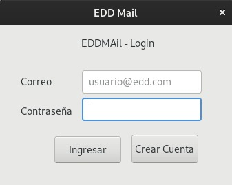

---

## 2. Acceso como Administrador (root)
Para entrar como **root**, use:  
- **Correo:** `root@edd.com`  
- **Contraseña:** `root123`

Luego presione **Ingresar**.

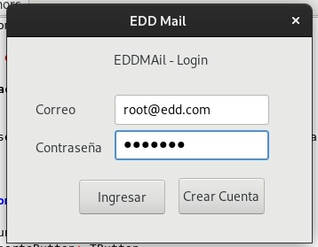

---

## 3. Menú del Administrador
Desde aquí puede realizar **Carga Masiva**, generar **Reportes de Usuarios**, **Reportes de Relaciones** y abrir la sección de **Comunidades**.

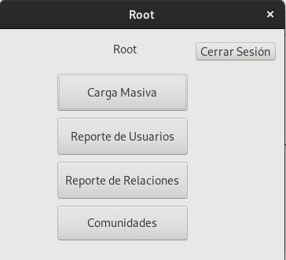

---

## 4. Carga Masiva
Permite importar usuarios desde un archivo JSON.  
Una vez cargados, el sistema muestra un mensaje con la cantidad de usuarios importados.

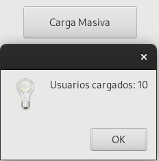

---

## 5. Reporte de Usuarios
Al presionar este botón se genera un archivo **.dot** y su versión **.png** con la lista de usuarios.

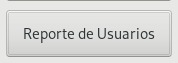

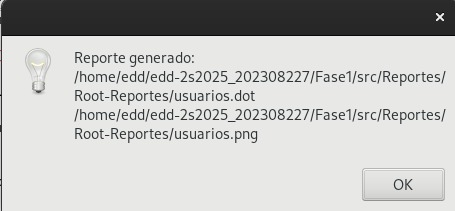

---

## 6. Reporte de Relaciones
Genera un reporte en forma de **matriz** donde se visualizan las relaciones entre remitentes y destinatarios.

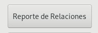

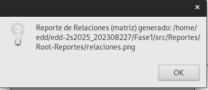

---

## 7. Comunidades
Acceso al módulo de **Comunidades**, donde se gestionan los grupos de usuarios.

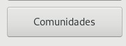

---
## 8. Formulario de Comunidades
En este apartado el administrador puede gestionar las **comunidades** de usuarios.  
Se permite crear nuevas comunidades, agregar usuarios a ellas y generar reportes relacionados.

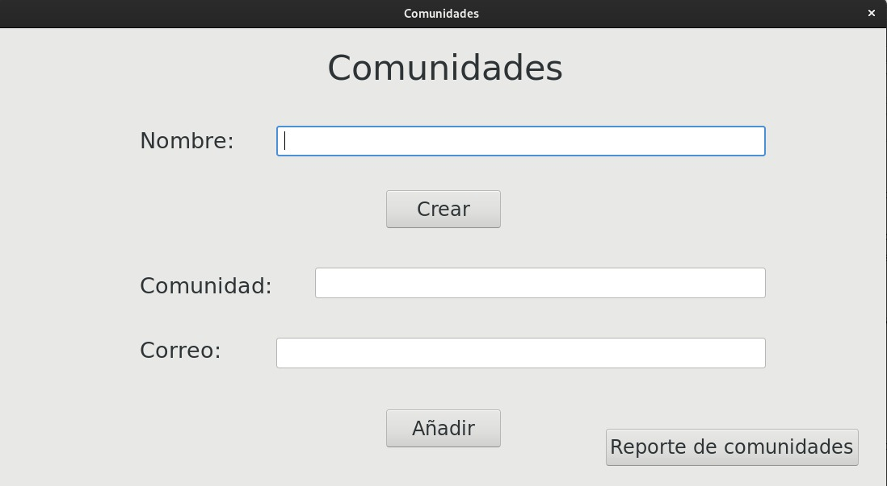

---

## 9. Crear Comunidad
Para registrar una nueva comunidad, ingrese el nombre en el campo correspondiente y presione el botón **Crear**.  

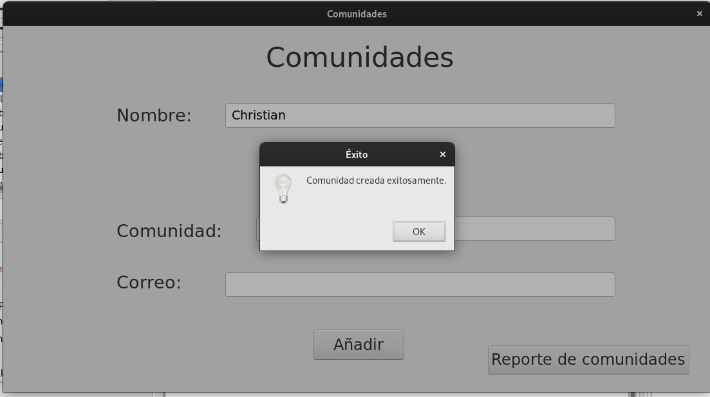

---

## 10. Agregar Usuario a Comunidad
Seleccione la comunidad deseada e ingrese el correo del usuario que desea asociar, luego presione **Agregar**.  

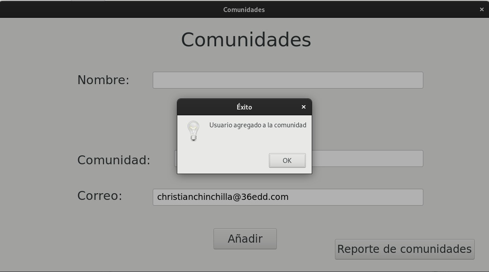

---

## 11. Reporte de Comunidades
El sistema permite generar un reporte visual donde se muestran las comunidades existentes y sus usuarios asociados.  

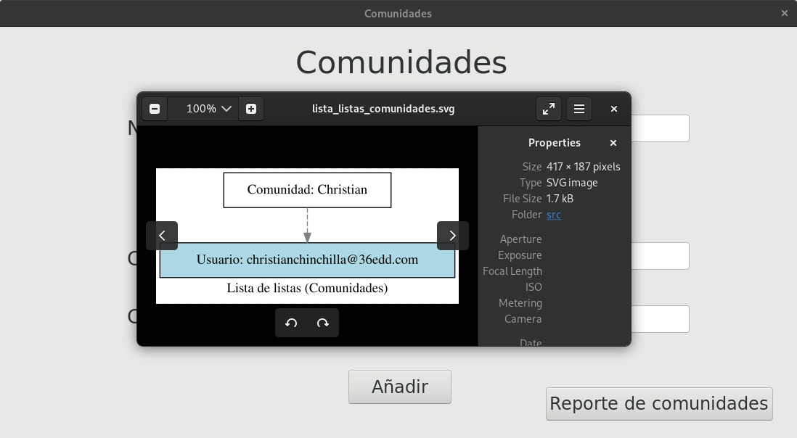

---

## 13. Interfaz de Usuario Normal
Cuando un usuario inicia sesión con sus credenciales personales, se muestra el menú principal del **Usuario Estándar**.  
Desde aquí puede acceder a la bandeja de entrada, enviar correos, ver la papelera, programar correos, administrar contactos, actualizar su perfil y generar reportes personales.

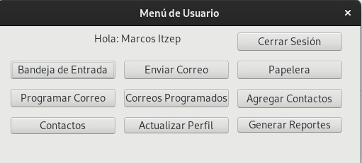

---

## 14. Bandeja de Entrada
La bandeja muestra todos los correos recibidos.  
- Puede ordenar los mensajes por asunto.  
- Doble clic abre el correo seleccionado.  
- El botón **Eliminar** envía el correo a la papelera.

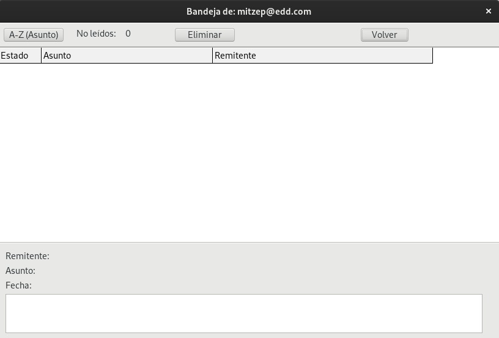

---

## 15. Enviar Correo
En este formulario el usuario puede redactar un correo:  
- Complete el campo **Para** con la dirección del destinatario.  
- Escriba el **Asunto** y el **Mensaje**.  
- Presione **Enviar** para que se agregue al buzón del destinatario.

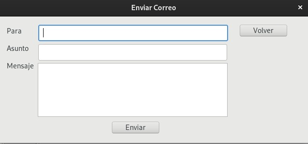

---

## 16. Papelera
La papelera muestra los correos eliminados.  
- Puede buscar por asunto.  
- Seleccione un correo y use la tecla **Delete** o el botón **Eliminar** para borrarlo definitivamente.

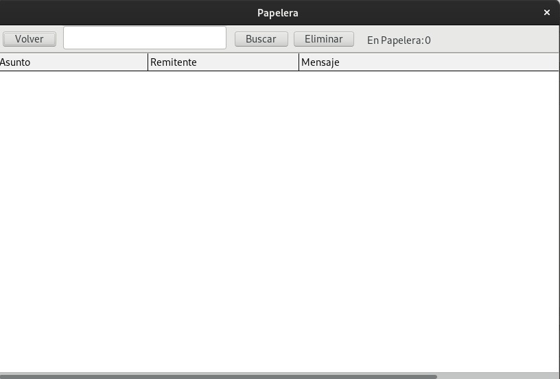

---

## 17. Programar Correo
En esta opción el usuario puede programar el envío de un correo indicando una fecha y hora específicas.  

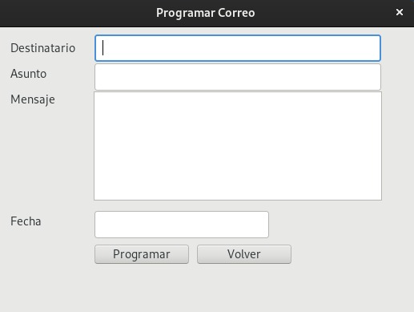

---

## 18. Correos Programados
Aquí se listan los correos pendientes por enviar.  
- El botón **Enviar** permite liberar todos los correos programados inmediatamente.  

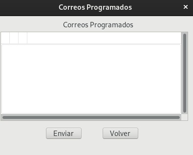

---

## 19. Contactos
El usuario puede navegar entre sus contactos registrados.  
Se muestran datos como nombre, usuario, correo y teléfono.  

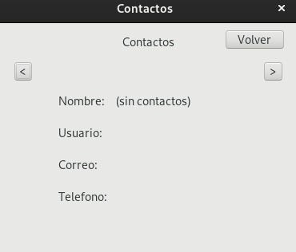

---

## 20. Nuevo Contacto
En esta ventana se puede agregar un nuevo contacto ingresando su correo electrónico.  
El sistema valida que el correo exista en la lista de usuarios.  

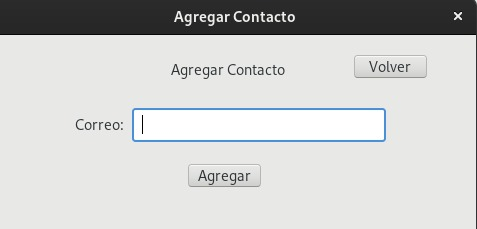

---

## 21. Perfil de Usuario
El usuario puede actualizar sus datos personales, como **nombre** y **teléfono**.  
Los campos de correo y usuario no pueden modificarse.

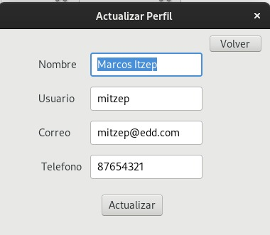

---

## 22. Reportes de Usuario
El sistema genera reportes gráficos de la actividad del usuario:  
- Correos recibidos.  
- Correos eliminados (papelera).  
- Correos programados.  
- Contactos registrados.  

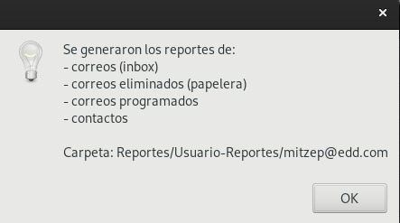

---

## 23. Reportes del Sistema

El sistema permite generar diversos **reportes gráficos** en formato **.dot** y **.png** mediante Graphviz.  
A continuación, se muestran los botones y ejemplos de salida de cada reporte.

---

### 23.1 Reporte de Usuarios
Al presionar el botón **Reporte de Usuarios**, el sistema genera un archivo `.dot` y su imagen `.png` mostrando la lista de usuarios registrados.

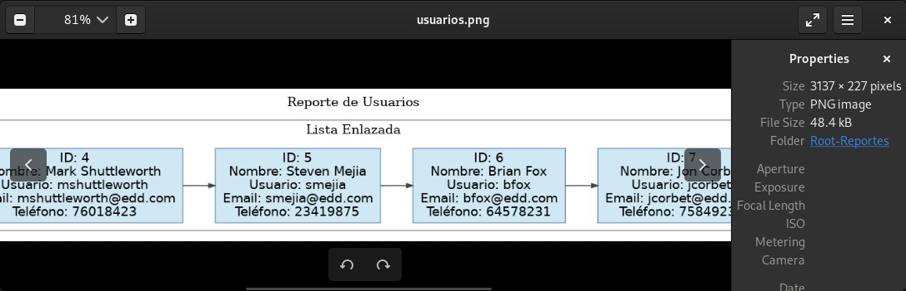  
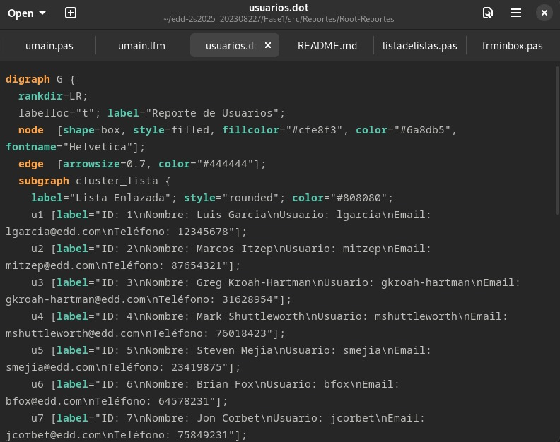

---

### 23.2 Reporte de Relaciones
Este reporte genera una **matriz de relaciones** entre remitentes y destinatarios, mostrando la interacción de correos entre usuarios.

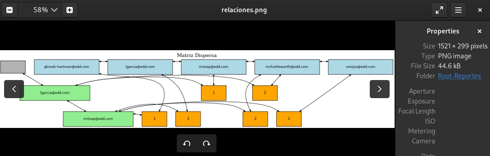  
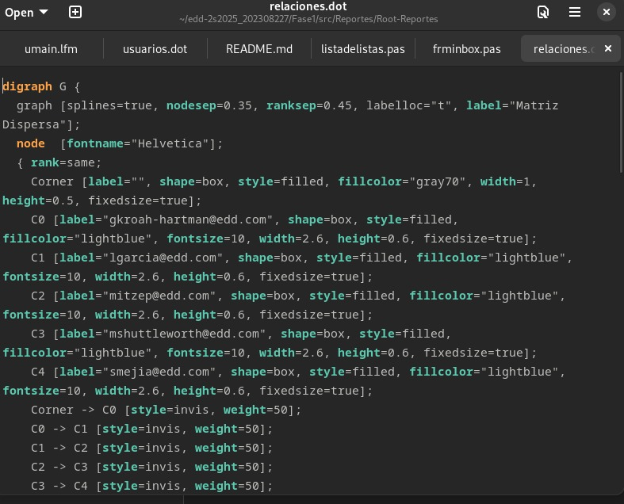

---

### 23.3 Reporte de Comunidades
El reporte de comunidades genera un grafo que muestra cómo los usuarios se agrupan en comunidades detectadas a partir de sus relaciones de comunicación.

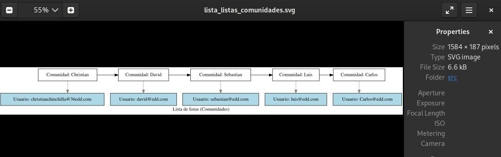  
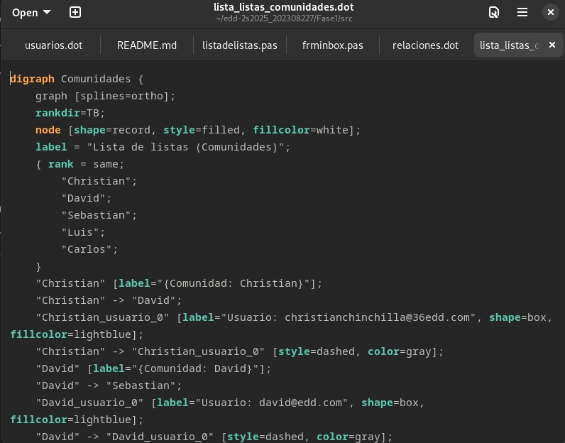

---

### 23.4 Reporte de Bandeja de Entrada
Desde el menú del usuario normal se puede generar el reporte de su **inbox**, representado como lista doblemente enlazada.

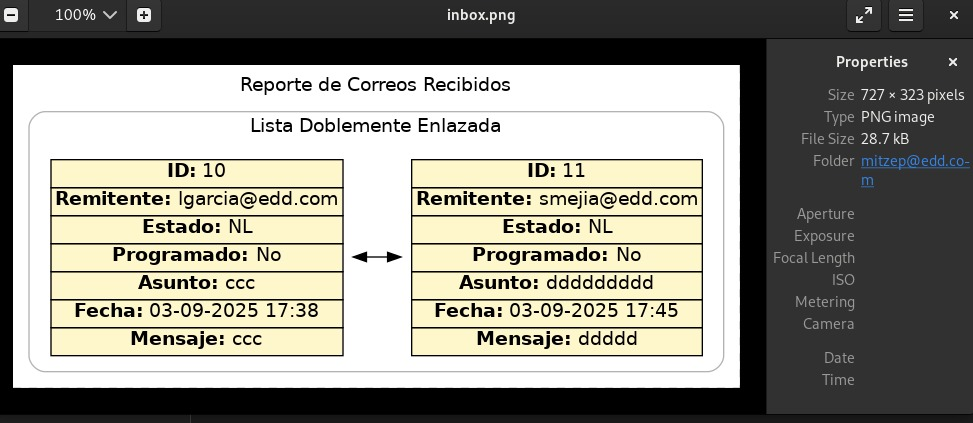
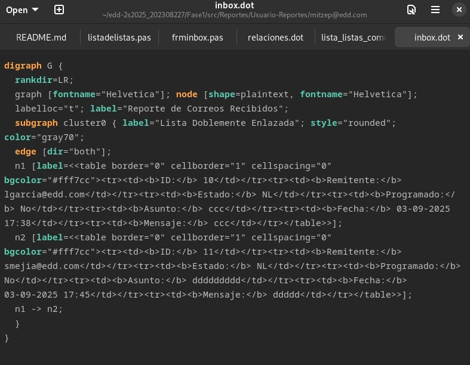

---

### 23.5 Reporte de Papelera
La papelera genera su reporte como una **pila**, mostrando los correos eliminados en orden LIFO.

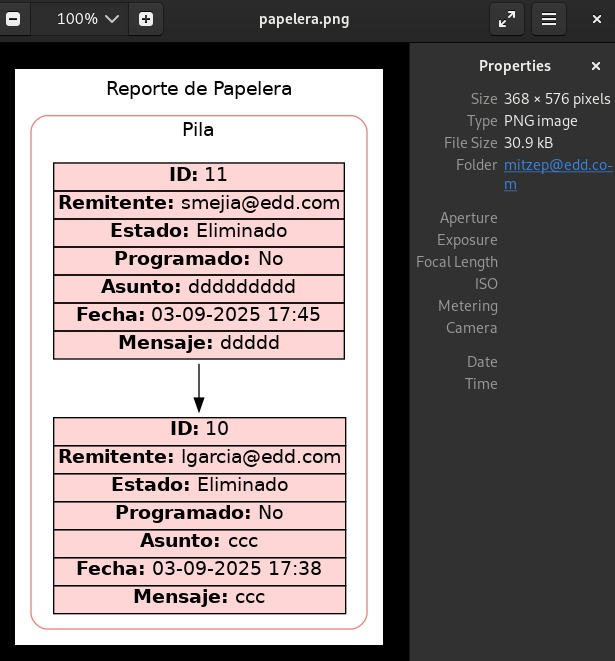
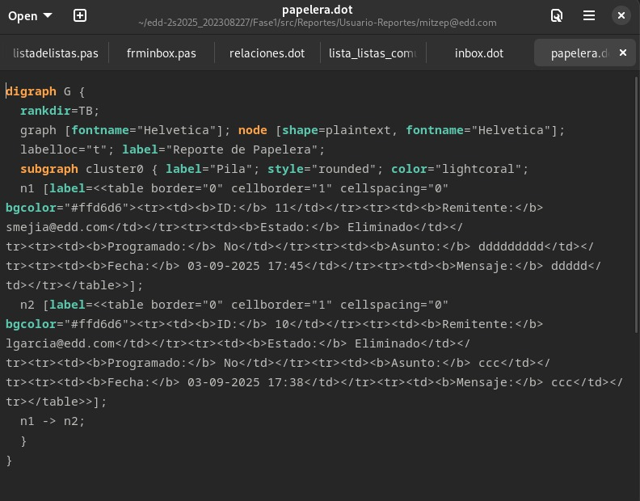

---

### 23.6 Reporte de Correos Programados
El reporte de la cola de correos programados se muestra en orden FIFO, indicando los correos pendientes.

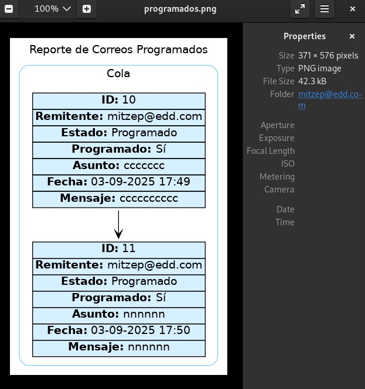
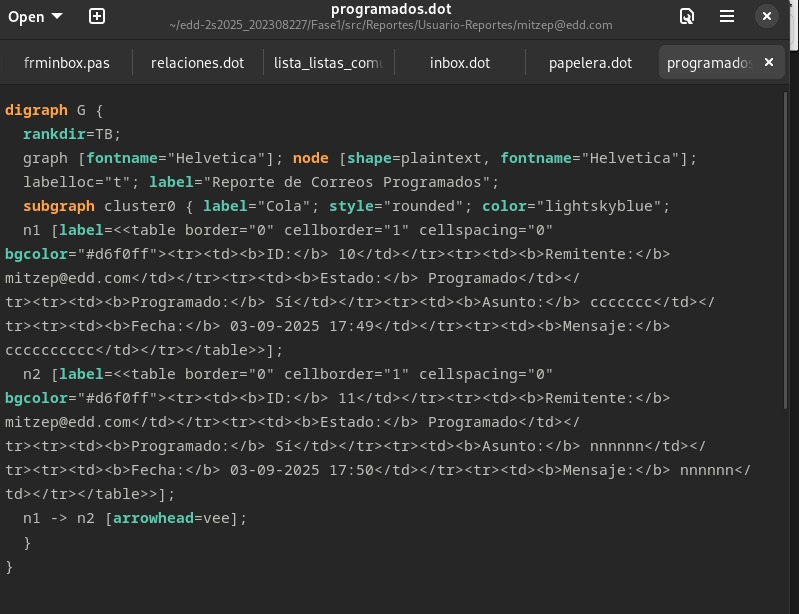

---

### 23.7 Reporte de Contactos
El reporte de contactos genera una lista circular con los contactos de cada usuario.

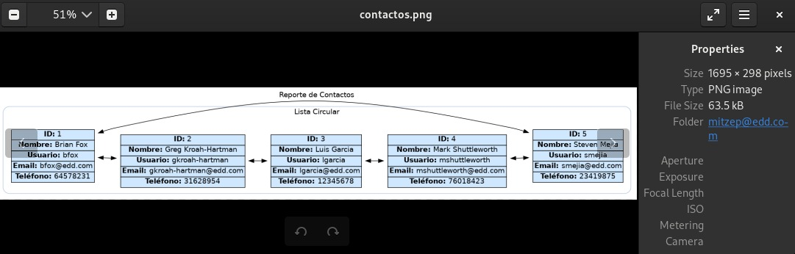
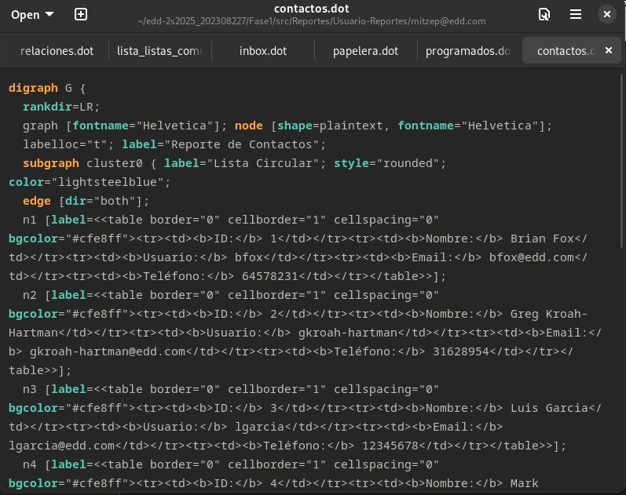

## Conclusión  

El presente manual mostró de manera clara y detallada el funcionamiento de **EDDMail**, explicando cada una de las interfaces disponibles tanto para el administrador (*root*) como para los usuarios normales. A través de capturas de pantalla y ejemplos prácticos, se documentaron los procesos de inicio de sesión, creación de cuentas, administración de contactos, envío y recepción de correos, manejo de bandeja de entrada, papelera y correos programados.  
