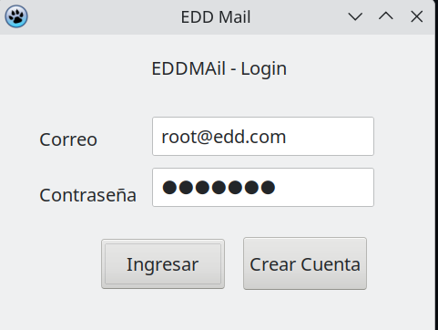
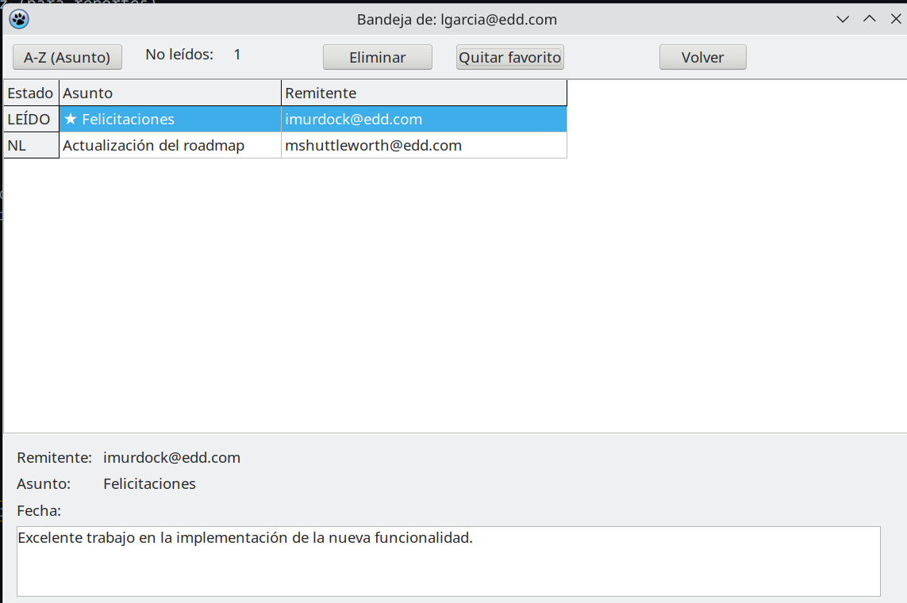
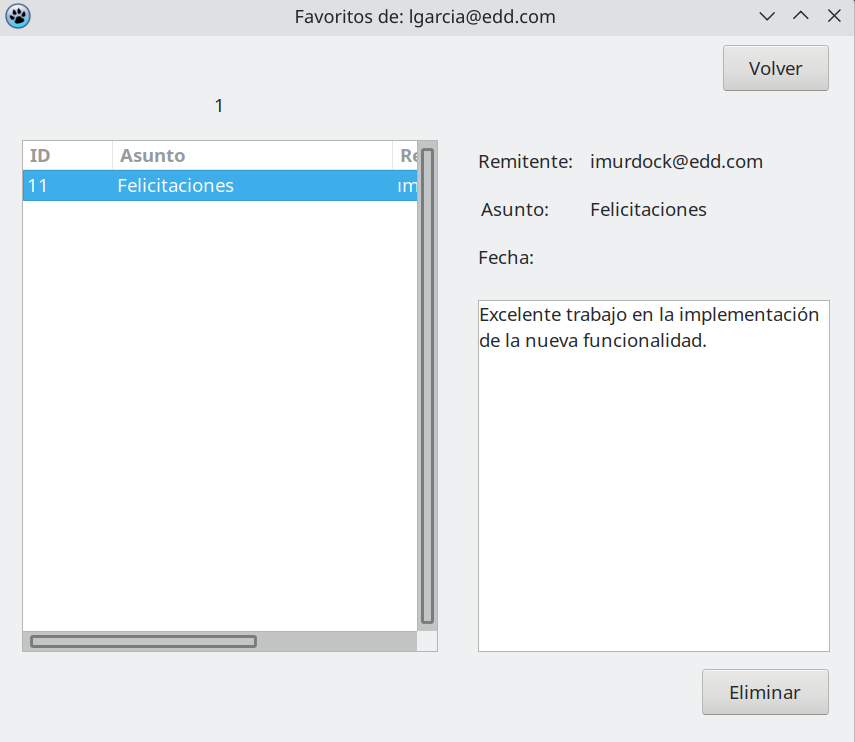
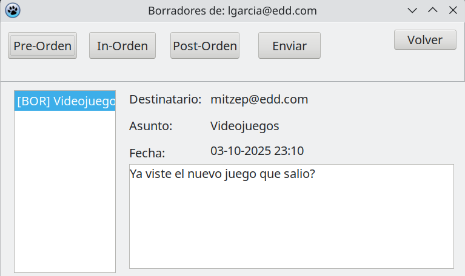
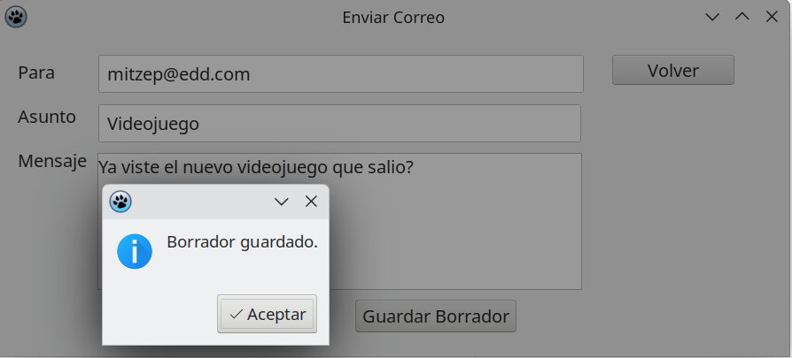
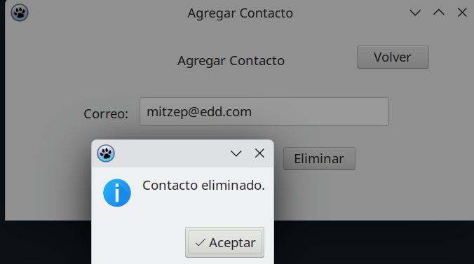
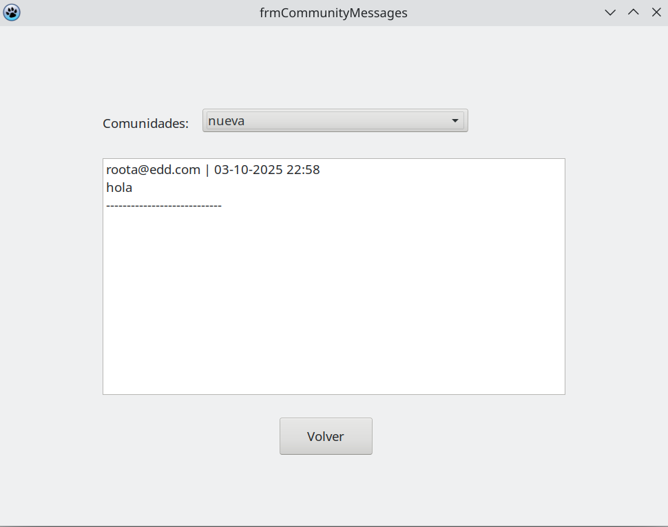
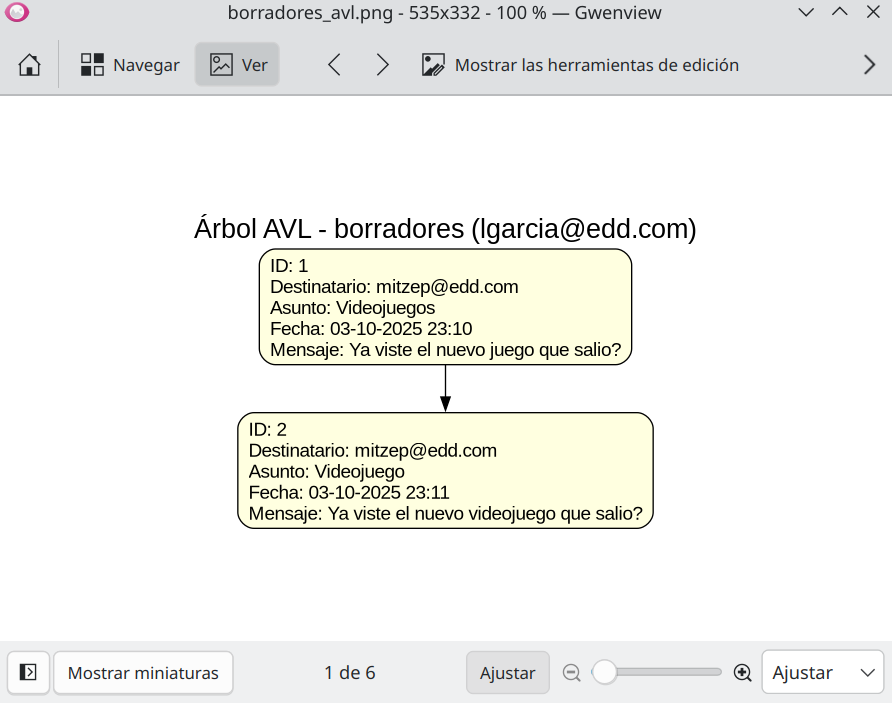
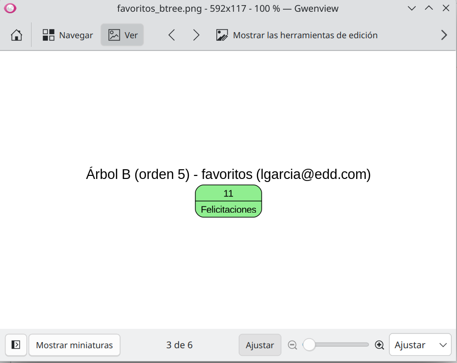

# Manual de Usuario — EDDMail Fase 2  
**Christian David Chinchilla Santos** – **202308227**  
**Curso:** Estructuras de Datos (EDD)

---

## 1. Introducción
El sistema **EDDMail** es un simulador de correo electrónico desarrollado en **Object Pascal/GTK**, que permite a los usuarios realizar operaciones comunes de correo: **enviar, recibir, eliminar, guardar como borrador, marcar como favorito y participar en comunidades**.  
Este manual está dirigido al **usuario final**, con instrucciones prácticas y ejemplos visuales para usar cada funcionalidad.

---

## 2. Requisitos
- **Sistema Operativo:** Linux (Debian/derivados).  
- **Entorno:** Lazarus + FPC.  
- **Dependencias:** GTK (para interfaces gráficas), Graphviz (para reportes).  
- **Inicio:** Ejecutar el programa `EDDMail`.  

---

## 3. Inicio de Sesión
1. Abrir el programa.  
2. Ingresar **correo** y **contraseña**.  
3. Elegir entre:  
   - **Usuario root** → acceso a carga masiva y reportes globales.  
   - **Usuario estándar** → acceso a bandeja, favoritos, borradores, contactos y comunidades.  

---

## 4. Funcionalidades para Usuario Estándar

### 4.1 Bandeja de Entrada
- Muestra los correos recibidos.  
- Cada correo tiene:
  - Estado: `NL` (no leído) o `L` (leído).  
  - Asunto, remitente, fecha.  
  - Botones: **Favorito** y **Eliminar**.  
- Al hacer doble clic se abre el detalle y se marca como leído.  

---

### 4.2 Favoritos
- Desde la bandeja se puede marcar un correo como **favorito**.  
- En el menú principal, opción **Favoritos**:
  - Lista con **ID, asunto, remitente**.  
  - Panel de detalle con mensaje completo.  
  - Botón **Eliminar** para quitar de favoritos.  

---

### 4.3 Borradores
- Al redactar un correo se puede **guardar como borrador** en lugar de enviarlo.  
- Los borradores se administran en un **árbol AVL**, con opción de verlos por:
  - PreOrden  
  - InOrden  
  - PostOrden  
- Desde aquí se puede reabrir, editar y enviar.  

---

### 4.4 Enviar Correo
1. Seleccionar **Redactar/Enviar correo**.  
2. Ingresar:
   - **Destinatario** (debe estar en contactos).  
   - **Asunto** y **mensaje**.  
3. Botones disponibles:
   - **Enviar** → se mueve a la bandeja del destinatario.  
   - **Guardar como borrador**.  

---

### 4.5 Contactos
- Se gestionan como lista circular.  
- Desde el menú se puede:
  - Navegar entre contactos con **Anterior / Siguiente**.  
  - Ver **nombre, usuario, correo, teléfono**.  
  - **Agregar o eliminar** contactos.  

---

### 4.6 Comunidades
- Cada comunidad se administra en un **árbol BST**.  
- Funciones disponibles:
  - Publicar mensaje en comunidad existente.  
  - Ver mensajes publicados.  
- Cada publicación incluye: **correo del autor, mensaje, fecha**.  

---

### 4.7 Reportes
El sistema genera reportes en formato `.dot` y `.png` mediante **Graphviz**:  
- **Correos recibidos** (lista doble).  
- **Papelera** (pila).  
- **Programados** (cola).  
- **Contactos** (lista circular).  
- **Favoritos** (árbol B).  
- **Borradores** (AVL).  
- **Comunidades** (BST).  

 

---

## 5. Observaciones de uso
- Solo se pueden enviar correos a contactos registrados.  
- Al eliminar un correo de la bandeja, este se mueve a la **papelera**.  
- Si un correo en papelera estaba en favoritos, se elimina automáticamente de favoritos.  
- Para publicar en comunidades, estas deben existir previamente (no se crean desde el usuario estándar).  

---

## 6. Conclusiones
El **Manual de Usuario** presenta los pasos básicos para utilizar EDDMail Fase 2. Con las nuevas funciones de **favoritos, borradores y comunidades**, el sistema se acerca más a un cliente de correo real, utilizando estructuras de datos avanzadas como **AVL, Árbol B y BST** para la gestión interna.

---
