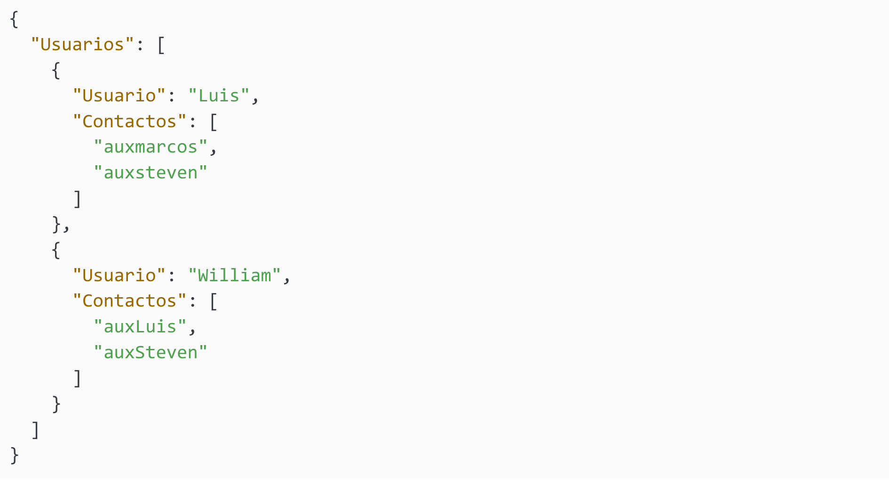
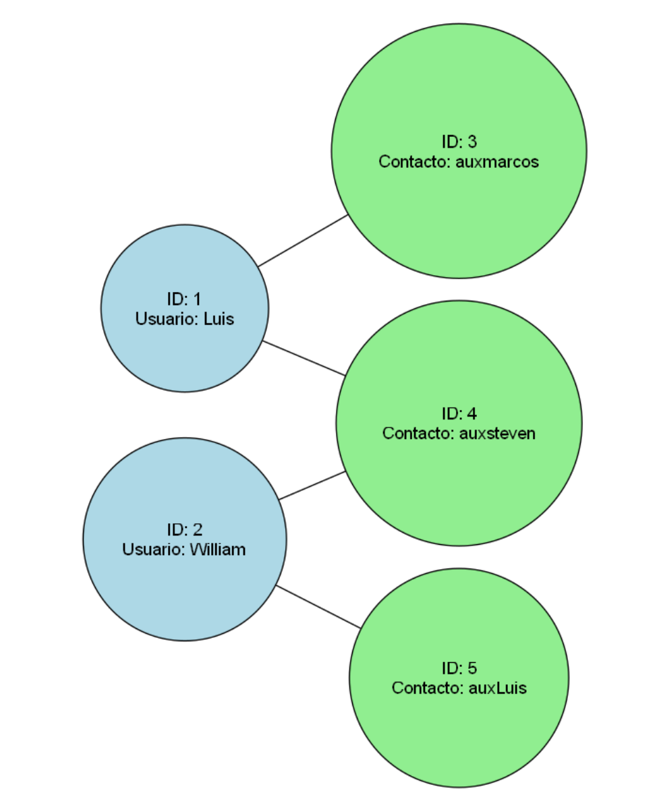

# Manual de Integración por Grupos — EDDMail Fase 3
**Grupo 11**  
**Curso:** Estructuras de Datos (EDD)   
**Funcionalidad:** Carga Masiva de Contactos y Reporte de Grafos

---

## Introducción

Este sistema permite la **carga masiva de contactos** y la generación de un **reporte visual en forma de grafo** para mostrar la relación entre los usuarios y sus contactos auxiliares.

--- 

###  Carga Masiva de Contactos

Esta imagen muestra la interfaz al seleccionar el archivo JSON y cargarlo exitosamente en el sistema.
Para ingresar múltiples usuarios con sus respectivos contactos, se utiliza un archivo en formato JSON con la siguiente estructura:

---

###  Reporte Visual del Grafo

Representación gráfica resultante:

---

