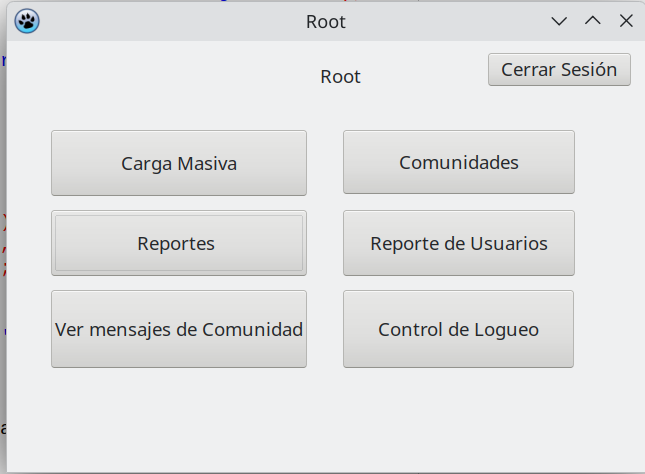
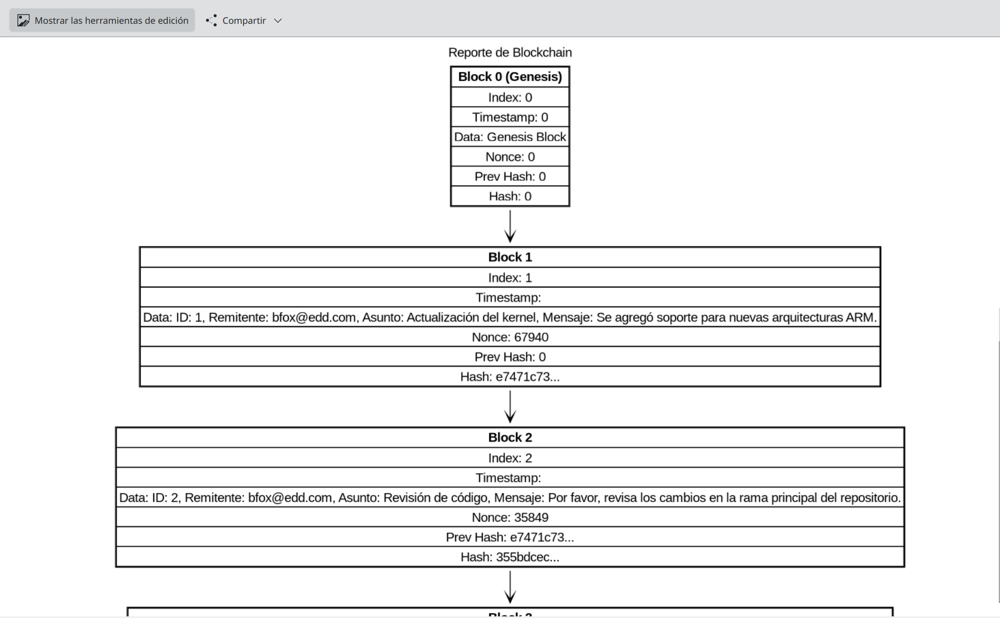
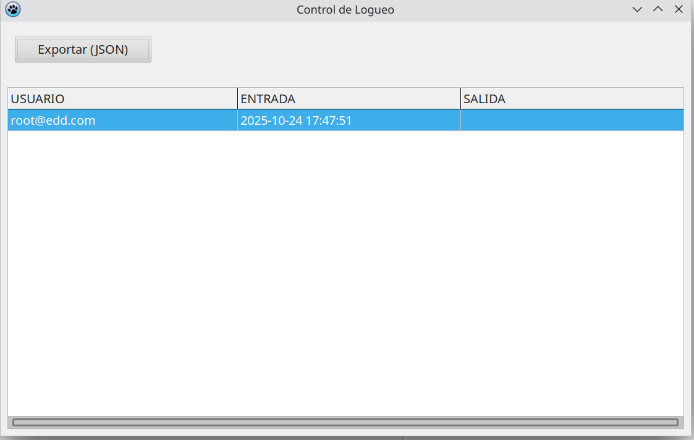
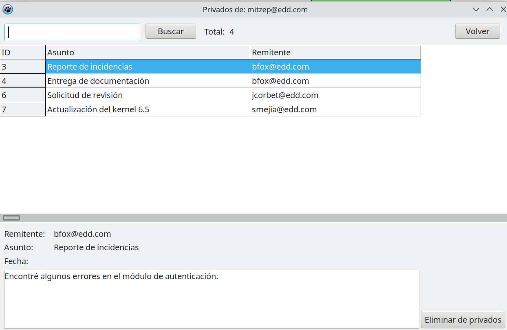

# Manual de Usuario — EDDMail Fase 2  
**Christian David Chinchilla Santos** – **202308227**  
**Curso:** Estructuras de Datos (EDD)
---

## 1 Descripción general

EDD Mail es una aplicación académica para gestionar usuarios, correos y estructuras de datos asociadas (listas, pilas, colas, árboles y grafos).  
Incluye generación de **reportes en Graphviz** (`.dot` y `.png`) para visualizar:

- Lista de usuarios
- Matriz de relaciones entre correos
- Árbol BST de Comunidades
- **Blockchain** derivado de la cadena de correos
- **Árbol de Merkle** de correos privados del usuario

---
## 2. Requisitos
- **Sistema Operativo:** Linux (Debian/derivados).  
- **Entorno:** Lazarus + FPC.  
- **Dependencias:** GTK (para interfaces gráficas), Graphviz (para reportes).  
- **Inicio:** Ejecutar el programa `EDDMail`.  


---
## 3. Carga Masiva

La función **Carga Masiva** permite importar datos desde archivos JSON al sistema.  
Se accede desde el botón **“Carga Masiva”** en el menú principal del usuario Root.

Al seleccionar un archivo, el sistema **detecta automáticamente el tipo de estructura** y carga:

- Usuarios (`usuarios.json`)
- Correos (`correos.json`)
- Contactos (`contactos.json`)



---

### 3.1. Carga de Usuarios

El archivo debe tener la clave raíz `"usuarios"`.  
Cada elemento representa un usuario con sus datos personales y credenciales.

**Ejemplo de `usuarios.json`:**

```json
{
  "usuarios": [
    {
      "id": 1,
      "nombre": "Mitzep",
      "usuario": "mitzep",
      "email": "mitzep@edd.com",
      "telefono": "555-0101"
    },
    {
      "id": 2,
      "nombre": "Steven",
      "usuario": "auxsteven",
      "email": "auxsteven@edd.com",
      "telefono": "555-0102"
    }
  ]
}
```
---
## 4) Reportes

El sistema EDD Mail genera diversos **reportes visuales** a partir de las estructuras de datos internas.  
Estos reportes se exportan automáticamente en formato **`.dot`** (Graphviz) y, si tienes Graphviz instalado, también en **`.png`**.

Los reportes se almacenan en las carpetas:
- `Reportes/Root-Reportes/` → reportes globales
- `Reportes/Usuario-Reportes/<correo_usuario>/` → reportes por usuario

Cada reporte permite **visualizar una estructura de datos** (lista, pila, cola, árbol o grafo).

---

### 4.1. Reporte de Contactos

**Genera:**  
`usuarios.dot` y `usuarios.png`

**Descripción:**  
Representa la lista de todos los usuarios registrados en el sistema.

**Cómo generarlo:**  
Pulsa el botón **“Reporte de Usuarios”** en la pantalla principal del Root.

**Resultado:**  
Se crea un diagrama donde cada nodo muestra:
- ID
- Nombre
- Usuario
- Email
- Teléfono

> 

---

### 4.2. Reporte de Blockchain

**Genera:**  
`blockchain.dot` y `blockchain.png`

**Descripción:**  
Representa la cadena de bloques (Blockchain) formada por los correos enviados.  
Cada bloque contiene la información de un correo, su hash y el hash del bloque anterior.

**Cómo generarlo:**  
- Automáticamente al generar el **Reporte de Relaciones**, o  
- Si tu versión del sistema lo incluye, mediante el botón **“Blockchain”**.

**Cada bloque incluye:**
- Index (posición)
- Timestamp (fecha/hora)
- Data (ID, remitente, asunto, mensaje)
- Nonce (valor pseudoaleatorio)
- Prev Hash (hash anterior)
- Hash (hash propio)

> _Espacio para imagen del Blockchain:_  
> 

---

### 4.3. Reporte de Árbol de Merkle de Privados

**Genera:**  
`privados_merkle.dot` y `privados_merkle.png`

**Descripción:**  
Muestra el **árbol de Merkle** generado con los correos de tipo `PR` (privados) de un usuario.  
Cada hoja contiene el hash del contenido del correo, y los niveles superiores combinan los hashes hijos.

**Cómo generarlo:**  
Este reporte se crea automáticamente cuando se generan los reportes del usuario con correos privados.

**Estructura:**
- Hojas: hash de los correos privados.
- Niveles: combinaciones MD5 sucesivas.
- Raíz: hash final que representa el conjunto completo.

> _Espacio para imagen del Árbol de Merkle:_  
> 

---

## 5. Logueo
EL fin de este modulo es saber quien entro y salio del sistema.

> 


## 6. Privado
El sistema EDD Mail cuenta con una funcionalidad especial para el **envío y gestión de correos privados**, los cuales no son visibles para otros usuarios dentro de la plataforma.  
Estos mensajes se diferencian de los correos normales por su **estado interno `PR` (Privado)** y forman parte del **Árbol de Merkle de Privados**, utilizado para garantizar la integridad de la información.

> 