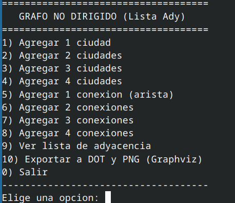
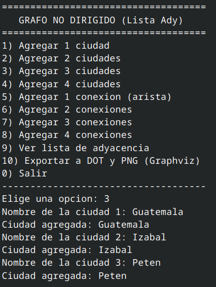
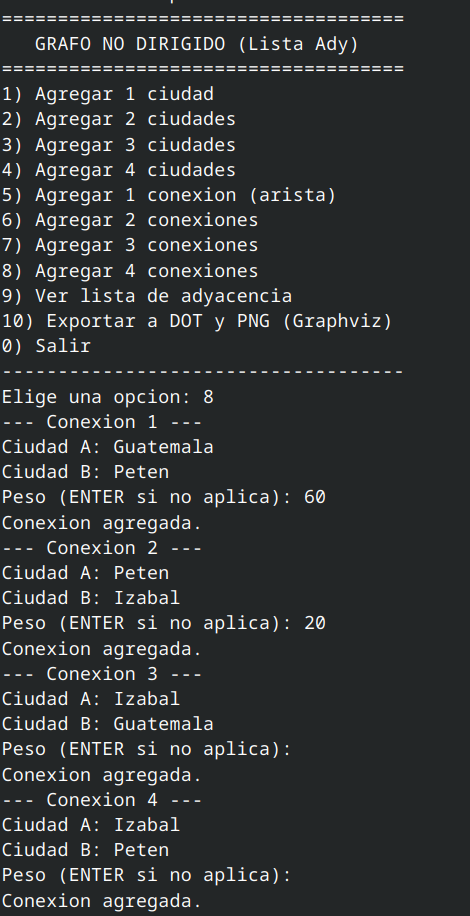
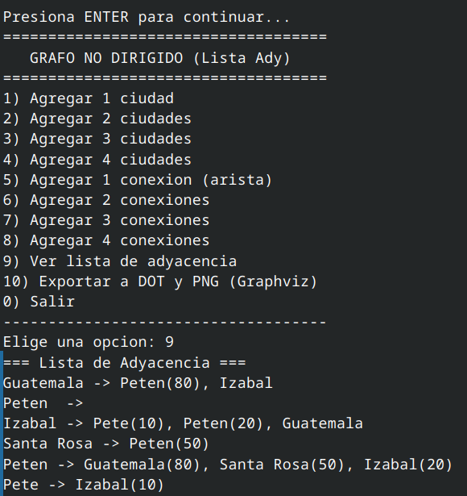
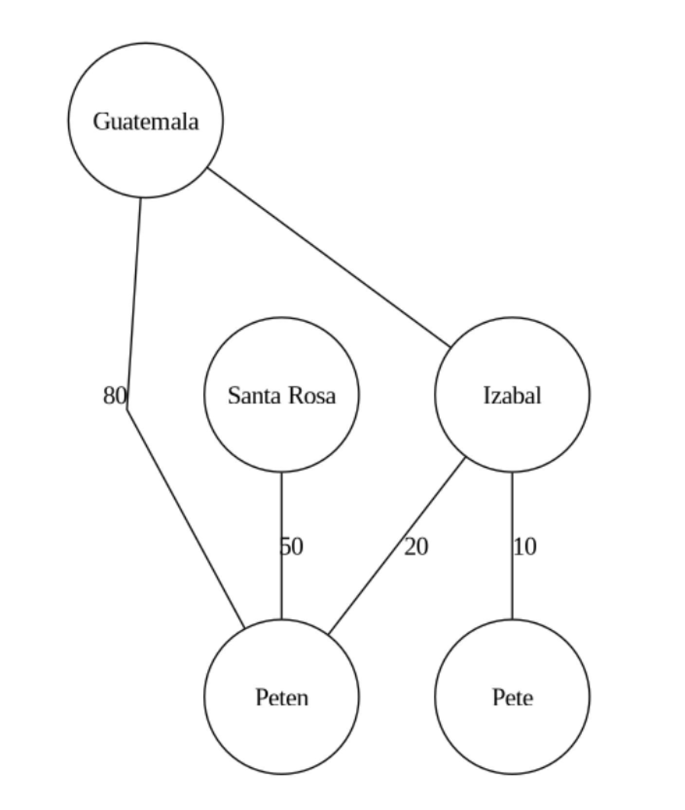

# Tarea 4 — Estructura de Datos

**Estudiante:** Christian David Chinchilla Santos  
**Carné:** 202308227  
**Curso:** Estructura de Datos   
---

## Descripción de la tarea

Este programa implementa un **Grafo No Dirigido** utilizando una **Lista de Adyacencia**.  
Cada nodo representa una **ciudad**, y cada arista una **conexión** bidireccional entre ellas.  
El grafo puede tener un **peso opcional** en cada conexión, representando distancia o costo de viaje.

El sistema permite agregar ciudades, establecer conexiones entre ellas, visualizar la lista de adyacencia en consola y generar una representación visual del grafo utilizando **Graphviz**.

---

## Funcionalidades

- Agregar 1, 2, 3 o 4 ciudades  
- Agregar 1, 2, 3 o 4 conexiones (aristas)  
- Visualizar la lista de adyacencia  
- Exportar el grafo en formato `.png` (Graphviz)  

---

## Estructura del Grafo

- **Nodos:** representan ciudades.  
- **Aristas:** representan conexiones entre ciudades.  
- **Bidireccional:** las conexiones se crean en ambos sentidos.  
- **Pesos opcionales:** se pueden indicar al crear la conexión.  

---

## Ejecución

### Requisitos:
- Lazarus (v2.2 o superior)
- Graphviz instalado:
  ```bash
  sudo apt install graphviz

### Para compilar y ejecutar:
lazbuild Tarea4Grafo.lpi
./Tarea4Grafo

### Ejemplo de uso
1) Agregar 4 ciudades
Guatemala
Peten
Santa Rosa
Izabal

6) Agregar 2 conexiones
Guatemala -- Peten
Peten -- Santa Rosa

10) Exportar a DOT y PNG (Graphviz)
Archivo DOT: grafo

---

## Consola




## Ciudades 



## Conexion 



## Ejemplo de Lista de Adyacencia



---

## Ejemplo Gráfico del Grafo



---

